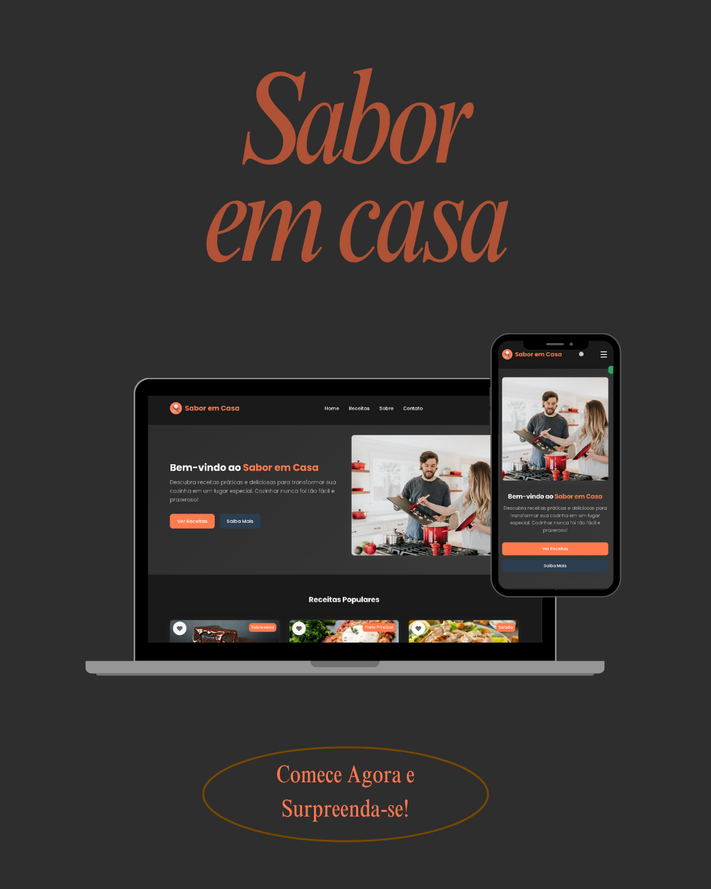

# 👨‍🍳 Sabor em Casa

**Sabor em Casa** é um site de receitas desenvolvido por mim com foco em **experiência do usuário (UX)**, **interface intuitiva (UI)** e design responsivo. O projeto foi criado 100% do zero — desde a **identidade visual**, **logo**, **layout**, até a **estrutura de código em HTML, Tailwind, CSS e JavaScript**.

  

  

  <i>Visual do projeto “Sabor em Casa” — site responsivo, leve e intuitivo para amantes da boa culinária 🍝.</i>

 

---

## 🔒 Repositório Privado

Este repositório está **privado** com o objetivo de proteger:

- A **autenticidade do código-fonte**
- A **identidade visual** criada exclusivamente para o projeto
- A **originalidade da marca e das soluções de UX/UI**

 

---

## 🚀 Tecnologias Utilizadas

- 🔹 **HTML5** — estrutura semântica e organizada  
- 🔹 **CSS3** — responsividade, animações e design moderno  
- 🔹 **JavaScript** — interatividade e manipulação dinâmica dos dados  
- 🔹 **Design UX/UI** — foco na navegação fluida, visual limpo e usabilidade
- 🔹 **SEO** — otimização para melhorar a indexação e visibilidade do site nos motores de busca, garantindo melhor ranqueamento.
- 🔹 **Logo e Marca** — criados manualmente para refletir o conceito do projeto
- 🔹 Figma — prototipagem e layout visual
- 🔹 Git/GitHub — versionamento e deploy

 

---

 

## 🧠 Sobre o Projeto

A proposta do **Sabor em Casa** é apresentar receitas de forma clara, atrativa e acessível. O site foi pensado para:

- 🧩 Navegação fácil em qualquer dispositivo  
- 🥗 Cards com receitas ilustradas, tempo de preparo, dificuldade e ingredientes  
- 🌙 Animações suaves e visual agradável  

 

---

 

## 📁 Estrutura do Projeto

<pre>
sabor-em-casa/
│
├── assets/
│   ├── mockup/
│   ├── img/
│       └── logo/
│ 
├── css/
│   └── style.css
│
├── js/
│   ├── action-buttons.js
│   ├── contact-form.js
│   ├── main.js
│   ├── README-MODULOS.md
│   └── receitas-data.js
│
├── pages/
│   ├── contato.html
│   ├── imprimir-receitas.html
│   ├── index.html
│   ├── print.html
│   ├── receita.html
│   ├── receitas.html
│   └── sobre.html
│
├──  robots.txt
├──  sitemap.xml
│
├── README-ATUALIZADO.md
└── README.md
</pre>

 

---

## 📱 Responsividade

O layout é totalmente adaptável a celulares, tablets e desktops, proporcionando uma navegação fluida e confortável em qualquer tela. Menus, imagens, grids e botões se ajustam automaticamente, garantindo que a experiência do usuário seja consistente e agradável, independentemente do dispositivo utilizado.

 

---

 

## 🛠️ Autor

Desenvolvido por **Lucas Silva** 💻 

- GitHub (Perfil): [Clique aqui](https://github.com/Lucas-tech-silva)  
- Portfólio: [Clique aqui](https://portif-lio-nu-two.vercel.app/)
- Linkedin: [Clique aqui](https://www.linkedin.com/in/lsssss-developer/)

 

---

## 📌 Status do Projeto

✅ Concluído | 💡 Melhorias futuras: animações adicionais, painel de favoritos, sistema de avaliação por estrelas ⭐⭐⭐⭐⭐, comentários dos usuários 💬, opção de salvar receitas 📌 e sistema de feedback 💬.

 

---

## 🎉 Fun Fact

  🍳 *Sabia que o primeiro utensílio de cozinha foi a colher?*  
  Ela é usada há mais de 20.000 anos! Muito antes de facas e garfos. 🥄

 

  

 

  <i>🍽️ "Criar é temperar ideias com dedicação — cada linha de código é um ingrediente que transforma experiências simples em algo inesquecível." — Lucas Silva </i>

 

  <i>Visual do projeto “Sabor em Casa” — site responsivo, leve e intuitivo para amantes da boa culinária 🍝.</i>

